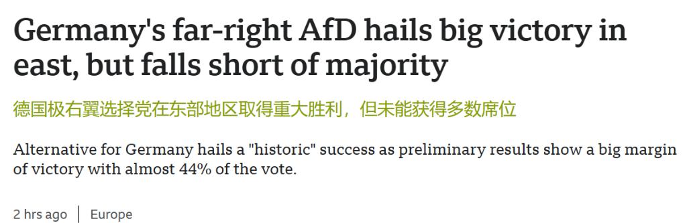
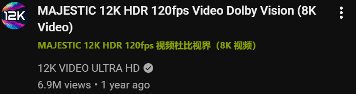

<div align="right">
  <a href="README.md">English</a> | <strong><a href="README_zh.md">简体中文</a></strong>
</div>

# HoldTranslate

网页沉浸式长按翻译与平滑还原 Chrome 扩展！

> **极速体验备忘：**  
> HoldTranslate 专为**无感阅读与零视觉干扰**而生。没有笨重的大色块卡片，没有突兀的 Google 图标水印，更没有花哨多余的控制栏。译文如原生双语字幕般自然融入在原文正下方，100% 同步继承原文的所有排版细节。

[](manifest.json)
[](manifest.json)
[](https://github.com/egggggod/HoldTranslate-plugin-for-chrome/releases)
[](LICENSE)

## 演示 (Demo)

> 完美适配绝大多数现代网页，包括复杂自适应流式页面、社交动态流（YouTube、X/Twitter）以及经典学术/新闻刊物（BBC、经济学人、ArXiv 等）。

点击直接下载最新版 [HoldTranslate Chrome 扩展安装包](https://github.com/egggggod/HoldTranslate-plugin-for-chrome/releases/download/v1.4.0/holdtranslate-chrome-extension-v1.4.0.zip) (v1.4.0)，解压后即可在 Chrome 中体验：

### 1. 浅色模式沉浸式阅读效果（如新闻、论文长文）


### 2. 深色模式与嵌套标题适配（如 YouTube 视频标题）


## 项目概览 (Overview)

本项目由三大核心模块构成：

1. **精准排版同步引擎 (Precision Typography Synchronizer)**：智能 DOM 分析器，1:1 提取并镜像原文的计算字号、粗体字重（针对 Windows 微软雅黑 Medium 字重做了视觉补偿）、斜体、下划线/删除线以及衬线体/非衬线体属性。
2. **多引擎智能翻译调度分发中心 (Multi-Engine Dispatcher)**：无缝集成 **Google 翻译**（免配置零门槛）、**Microsoft 微软翻译**（全自动 Session 凭证鉴权）、**DeepSeek 官方大模型 API**（`deepseek-chat`）以及任意 **自定义 OpenAI 兼容接口**（GPT-4o、Claude、硅基流动、Ollama、Kimi 等）。
3. **视觉优先设置体系与沉浸调色 (Visual-First Customizer & Timing Engine)**：采用视觉优先型层次结构，彻底解决色块边框遮挡，全域联动插件主题色，精简意图确认出圈时延说明，并支持二次长按平滑还原。

## 项目结构 (Project Structure)

```bash
HoldTranslate-plugin-for-chrome/
├── assets/             # 效果演示截图与预览素材
│   ├── demo-light.png
│   └── demo-dark.png
├── icons/              # 扩展图标 (16x16, 48x48, 128x128)
├── manifest.json       # Chrome 扩展配置文件 (Manifest V3)
├── background.js       # 多服务后台 Service Worker (Google, 微软, DeepSeek, 自定义 LLM)
├── content.js          # 核心脚本：长按事件监听、排版智能提取、译文插入与还原
├── content.css         # 沉浸式译文动画与基础样式
├── popup.html          # 扩展设置双视图弹窗界面
├── popup.css           # 设置面板样式、调色盘呼吸留白与 API 配置卡片
├── popup.js            # 双视图切换、引擎选择器、调色板联动与 API 持久化
├── test.html           # 全场景本地测试基准页（含 YouTube 标题、斜体、下划线等）
├── LICENSE             # MIT 开源协议
├── README.md           # 英文主说明文档
└── README_zh.md        # 中文说明文档 (简体中文)
```

整个项目结构轻量清晰，不依赖任何第三方打包工具或重量级依赖，纯原生现代 Web 技术编写，开箱即用。

## 浏览器扩展特性 (Features)

- 🌐 **多引擎翻译矩阵 (Multi-Engine Matrix)**：自由切换 **Google 翻译**、**Microsoft 微软翻译**、**DeepSeek 大模型** 以及 **自定义 OpenAI 兼容接口**（支持 GPT-4o、Claude、硅基流动、Ollama 本地模型）。
- 🪟 **VisionOS 液态玻璃拟态美学 (Liquid Glass)**：基于苹果 VisionOS 风格的高通透磨砂毛玻璃 (`backdrop-filter: blur(28px) saturate(190%)`)，卡片通透度大幅优化（20%~38%），镜面高光边缘倒角与深空黑曜石暗黑玻璃。
- 🎛️ **液态玻璃独立开关**：在设置页「✨ 视觉外观」中置顶加入独立开关，一键在晶莹液态玻璃与极简纯色经典卡片之间随心切换。
- ⚡ **主界面极致图形化与去文字化**：去除冗余副标题文案，底栏采用高质感纯图标操作按钮（⚙️ 偏好设置 + ↗ 测试页，带悬停提示），极窄呼吸微光药丸指示器（`● 就绪`），设置页分类增加精致图形符号（`✨/⏱️/🤖`）。
- 🎯 **1:1 原生排版与富文本样式镜像**：精准匹配原文计算字号（专项穿透适配 YouTube `#video-title` 标题），自动同步加粗、斜体、下划线，智能感知衬线体（宋体）与非衬线体（黑体）。
- 🎨 **零遮挡呼吸调色盘与动态流体光晕联动**：圆形调色盘按钮（🎨）呼出系统拾色器；容器四周增加呼吸间距彻底杜绝最左侧色块贴边遮挡；切换颜色时，底层环境流体光球与界面强调色实时同步变色。
- 🖱️ **超链接滑动/手势完美兼容**：全面兼容鼠标左键滑动/拖拽超链接（支持拖拽至标签页、书签栏打开，以及 CrxMouse、smartUp 等超级拖拽插件与鼠标手势），长按翻译与滑动打开互不干扰。
- 📋 **段落与划词双模式**：直接长按翻译整段文本；先划选高亮文字再长按仅翻译选定内容。
- 🛡️ **自适应深浅双色美感**：根据系统与浏览器主题自动切换纯净浅白或沉浸深黑，内置 7 色护眼预设，支持自定义 Hex 色值与深浅色模式实时预览。

### 🚀 快速安装指南 (Quick Install Guide)

1. **直接下载安装包（推荐 - 最新 v1.4.0）**
   - 访问我们的 **[Releases 发布页面](https://github.com/egggggod/HoldTranslate-plugin-for-chrome/releases)**（或点击直接下载：[holdtranslate-chrome-extension-v1.4.0.zip](https://github.com/egggggod/HoldTranslate-plugin-for-chrome/releases/download/v1.4.0/holdtranslate-chrome-extension-v1.4.0.zip)）；
   - 解压下载好的 `.zip` 文件；
   - 打开 Chrome 浏览器，在地址栏输入访问：`chrome://extensions/`；
   - 打开页面右上角的 **“开发者模式”**；
   - 点击左上角的 **“加载已解压的扩展程序”**，选择刚刚解压的文件夹。

2. **Git 克隆安装（适合开发者）**
   ```bash
   git clone https://github.com/egggggod/HoldTranslate-plugin-for-chrome.git
   ```
   - 同样在 `chrome://extensions/` 中点击“加载已解压的扩展程序”选择克隆目录即可。

### 🎉 开始使用 (Getting Started)

安装完成后：
1. 点击 Chrome 工具栏中的 **HoldTranslate** 图标，在快捷面板秒切翻译引擎，或进入设置填写大模型 API Key；
2. 访问任意英文或外语网页（也可在 Chrome 中直接打开项目内的 [`test.html`](test.html) 本地测试页）；
3. 在任意文本段落上**长按鼠标左键**约 500ms；
4. 译文将如同原生双语字幕般平滑出现在原文下方；
5. 需要恢复纯净页面时，再次长按即可平滑移除！

## 为什么选择 HoldTranslate？ (Why Use HoldTranslate?)

- **零干扰 (Zero Distraction)**：没有广告、没有水印卡片、没有阻挡视线的悬浮窗。
- **视觉浑然一体 (Visual Harmony)**：译文字号与排版与原文 100% 严密贴合，视觉体验如网页天生自带双语。
- **多引擎随心选 (Multi-Engine)**：免配置的 Google/微软高速接口与高智能大模型（DeepSeek/GPT-4o）随时切换。
- **纯净安全 (Privacy & Lightweight)**：纯原生 JavaScript 编写，无第三方打包埋点，无任何数据追踪。

## 版本发布与维护 (Release Page & Versioning)

- **Release 发布页面**：请访问 **[GitHub Releases Page](https://github.com/egggggod/HoldTranslate-plugin-for-chrome/releases)** 获取各版本的更新日志（Changelog）与编译好的打包文件。
- **版本规范**：严格遵循 [语义化版本 (SemVer)](https://semver.org/lang/zh-CN/) 规范（`vMAJOR.MINOR.PATCH`）。
  - 当前版本：`v1.4.0`
  - `v1.4.0` 更新重点：
    - 全新引入 Apple VisionOS 风格液态玻璃（Liquid Glass）高通透磨砂拟态系统与动态多色环境流体光晕；
    - 在偏好设置「✨ 视觉外观」新增独立液态玻璃开关（默认开启），支持平滑回退至极简经典卡片；
    - 主界面（Quick View）极致图形化与去文字化：移除冗余副标题，底栏升级为纯图标毛玻璃按钮（⚙️ 设置 + ↗ 测试页），状态栏升级为呼吸光点微胶囊（`● 就绪`）；
    - 调色盘选色与底层流体光球多色折射实时联动，暗色黑曜石玻璃通透度大幅提升。
  - `v1.3.0` 更新重点：
    - 新增 Microsoft 微软翻译与主流大模型 API 翻译（DeepSeek 官方 API + 自定义 OpenAI 兼容接口）；
    - 快捷面板新增翻译引擎切换下拉胶囊，支持秒级切换；
    - 采用视觉优先型设置布局（开关 → 调色盘与双色预览 → 手势与时延 → API 配置）；
    - 优化调色板留白与溢出属性，彻底根除最左侧绿色色块光环贴边遮挡问题；
    - 简短精炼意图确认延迟说明；
    - 移除繁简互译切换开关，中文网页默认自动跳过中文以避免冗余触发。
  - `v1.2.0`：
    - 新增圆形调色盘自选按钮（🎨），支持任意颜色拾取与实时 HEX 联动；
    - 独创呼吸留白双层外环，彻底解决颜色色块被边框遮挡贴边问题；
    - 全域主题色联动：所选译文颜色自动同步至开关滑块、按钮、滑条与高亮边框。
  - `v1.1.0`：
    - 全新重构双视图弹窗：极简紧凑快捷面板 + 平滑推拉切换至完整设置；
    - 快捷界面新增源/目标语言双胶囊下拉框与一键互换；
    - 新增翻译服务指示与当前页面特权状态动态检测；
    - 全面适配系统/浏览器级深浅色自适应主题。
  - `v1.0.2`：
    - 修复因拦截 `dragstart` 导致超链接无法滑动/拖拽打开的问题；
    - 增加拖拽启动即时熔断：一旦用户滑动拖拽超链接，立刻取消长按计时器并收起进度环。
  - `v1.0.1`：
    - 修复 BBC 等复杂新闻卡片使用 Stretched Link 全卡片覆盖伪元素时误触发上方标题翻译的问题；
    - 修复 BBC 关联视频链接等水平 Flex 容器内插入译文被挤到右侧的问题；
    - 强化译文元素流式排版（`width: 100% !important; clear: both !important;`）。
  - `v1.0.0`：初版发布（沉浸式排版、1:1 字号/加粗/斜体/下划线排版镜像、YouTube 专项穿透、防误触双滑条与 7 色调色板）。
  - 后续更新：直接在 Releases 页面下载最新 zip 替换本地文件，在 `chrome://extensions/` 中点击刷新图标 (⟳) 即可无缝升级。

## 参与贡献 (Contributing)

非常欢迎提交 Issue 或 Pull Request：
- 通过 [GitHub Issues](https://github.com/egggggod/HoldTranslate-plugin-for-chrome/issues) 提交反馈或建议
- 提交对更多特定网页排版的优化与适配
- 提交 PR 共同完善功能

## 开源协议 (License)

本项目基于 [MIT License](LICENSE) 开源协议。
